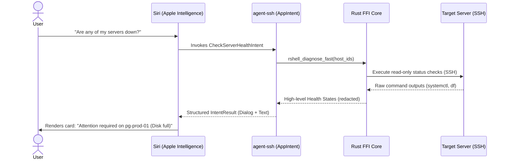

# 01. Siri Assistant Schemas for Server Health

## Overview

Siri in iOS 18 and macOS Sequoia uses **Assistant Schemas** to natively understand and execute app actions. By mapping `agent-ssh`'s health check features to these system schemas, users can query their entire server infrastructure via Siri using natural language (e.g., *"Siri, which of my servers are offline?"*). The system uses Apple Intelligence to process the query, invokes our local background diagnostic collectors, and presents a beautifully formatted, private summary directly inside the Siri overlay.

---

## Technical Architecture

To make our diagnostic actions discoverable, we conform our Swift `AppIntent` structures to specific Apple Intelligence schemas. Under the hood, this integrates with the `AppIntents` framework.

### AppIntent Schema Integration

Here is a Swift concept illustrating how to expose server diagnostics to Siri:

```swift
import AppIntents
import Foundation
import AgentSshMacOS // Shared framework

/// AppIntent exposed to Apple Intelligence for querying host health.
@available(iOS 18.0, macOS 15.0, *)
struct CheckServerHealthIntent: AppIntent {
    static var title: LocalizedStringResource = "Check Server Health"
    
    // Conforms this intent to Siri's system schemas for status and diagnostics
    static var assistantSchemas: [AssistantSchema] {
        [.systemStatus, .diagnostics]
    }
    
    @Parameter(title: "Server Name", description: "The nickname or IP of the host to check. If omitted, all servers are scanned.")
    var serverName: String?

    func perform() async throws -> some IntentResult & ReturnsValue<String> & ProvidesDialog {
        // 1. Retrieve the connection profile matching the requested name or all profiles
        let profiles = try await HostStore.shared.fetchProfiles()
        
        let targetProfiles = if let name = serverName {
            profiles.filter { $0.name.localizedCaseInsensitiveContains(name) }
        } else {
            profiles
        }
        
        guard !targetProfiles.isEmpty else {
            return .result(
                value: "No matching servers found.",
                dialog: "I couldn't find any servers matching that name in your connections."
            )
        }
        
        // 2. Trigger the local, read-only diagnostic collectors in the Rust FFI
        var unhealthyList: [String] = []
        for profile in targetProfiles {
            // Safe read-only inventory check
            let state = try await BridgeManager.shared.diagnoseFast(hostId: profile.id)
            if state.severity == .high || state.severity == .critical {
                unhealthyList.append("\(profile.name) (\(state.summary))")
            }
        }
        
        // 3. Generate the response text
        if unhealthyList.isEmpty {
            return .result(
                value: "All systems nominal.",
                dialog: "Everything looks clean! All of your \(targetProfiles.count) monitored hosts are performing within normal limits."
            )
        } else {
            let listString = unhealthyList.joined(separator: ", ")
            return .result(
                value: "Attention required on \(unhealthyList.count) host(s): \(listString)",
                dialog: "It looks like \(unhealthyList.count) of your servers need attention: \(listString)."
            )
        }
    }
}

/// Link the intent to the AppShortcutsProvider so Siri registers it instantly at install time.
struct AgentSshShortcuts: AppShortcutsProvider {
    static var appShortcuts: [AppShortcut] {
        AppShortcut(
            intent: CheckServerHealthIntent(),
            phrases: [
                "Check server status in \(.applicationName)",
                "Is my website server down in \(.applicationName)",
                "How are my servers doing in \(.applicationName)"
            ],
            shortTitle: "Check Server Status",
            systemImageName: "server.rack.status.badge.warning"
        )
    }
}
```

### Flow Diagram



---

## Native User Experience

1. **Siri Voice Triage**: The user triggers Siri on an Apple Watch, iPhone, iPad, or Mac and asks for a health check. Siri executes the read-only scan asynchronously, showing a native spinner, and then responds with a spoken summary and a rich visual snippet card.
2. **Siri Snippet View**: The snippet card displays a mini list of monitored servers with green/red status rings. Tapping any row directly launches the **Server Doctor** in `agent-ssh` to show the full evidence list.
3. **No-Unlock Check**: Allows users to check high-level system health from their locked devices securely, using the pre-compiled state without exposing sensitive connection variables.

---

## Data Privacy & Guardrails

* **Zero Shell Expansion**: Siri cannot customize the diagnostic commands run. The intent is strictly bound to our verified, hardcoded `Broad Host Collector` command allowlist.
* **Strict Local Redaction**: All command output parsing and redaction of tokens/secrets take place inside our Swift/Rust boundaries before generating Siri's dialog text.
* **Read-Only Enforcement**: Siri can never invoke any mutating commands. If a user asks *"Siri, restart my web server"*, the system replies that mutations must be performed manually inside the app for security.

---

## Marketing & Positioning Strategy

### The Headline / Elevator Pitch
> *"Siri, how are my servers doing?"—Your entire infrastructure, triaged by Apple Intelligence.*

### Feature Showcase Scenario (App Store Video Storyboard)
* **Visual**: A developer is away from their desk walking their dog, wearing an Apple Watch.
* **Action**: They raise their wrist and say: *"Siri, check my servers in Midnight SSH."*
* **Animation**: Siri displays a native visual card with a red warning: `pg-prod-01 (Out of Memory warning: Postgres crashed)`.
* **Action**: The developer taps the card. The phone opens directly to the **Server Doctor** showing the exact raw `dmesg` lines, the redacted evidence, and the safe recommended inspect commands.
* **Voiceover**: *"Never be in the dark during an outage. Triage incidents in plain English directly from your wrist, without typing a single terminal command."*

### Developer Buzzwords & Messaging
* **App Intents Integration**: Deep system-level connection.
* **Siri Smart Triage**: Natural language interface for infrastructure monitoring.
* **Privacy-First Devops**: On-device Apple Intelligence reasoning that keeps private server keys locked inside the Apple Secure Enclave.

### Competitive Edge (Why Competitors Can't Compete)
* **Termius**: Focuses on proprietary cloud synchronization, making local Apple Intelligence integrations secondary. They do not integrate with native App Intents at this depth.
* **ShellFish**: Provides excellent file provider access but lacks a structured diagnostic engine or custom local LLM semantic models.
* **Our Edge**: By coupling the Rust-based deterministic collectors with Siri's Assistant Schemas, `agent-ssh` becomes the most deeply integrated DevOps utility on the Apple platform.
