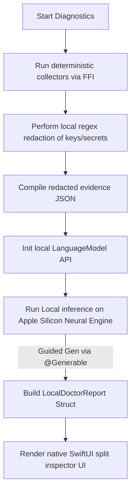

# 02. On-Device Foundation Models for Local Diagnostics

## Overview

The cornerstone of the **Server Doctor** is privacy. Sending server log dumps, configuration paths, and running process lists to external cloud-hosted LLM endpoints is a severe security risk for production hosts. By leveraging Apple's native **Foundation Models framework**, `agent-ssh` runs all diagnostic reasoning locally on the device's Apple Silicon Neural Engine. 

By employing Apple's `@Generable` structured output macros, the app guides the local system-level language model to transform raw terminal collector outputs directly into structured Swift objects representing health findings, complete with safety guardrails and citations.

---

## Technical Architecture

Apple's Foundation Models framework provides high-level APIs to access on-device language models. Instead of raw text completion, we utilize **Guided Generation** using the `@Generable` macro. This forces the model to fill in a pre-defined Swift schema, preventing formatting hallucinations (which are common with smaller local models).

### Swift Guided Generation Implementation

```swift
import Foundation
import FoundationModels // Native system-level LLM framework

/// The structured finding output we expect from the on-device LLM.
@Generable
@available(iOS 18.0, macOS 15.0, *)
struct DiagnosticFinding: Codable {
    enum Severity: String, Codable {
        case critical
        case warning
        case info
    }
    
    let title: String
    let summary: String
    let severity: Severity
    let confidence: Double // Scale of 0.0 to 1.0
    let affectedService: String
    let evidenceIds: [String]
    let safeNextStepDescription: String
    let actionsToAvoid: [String]
}

/// The overall diagnostic report containing multiple findings.
@Generable
@available(iOS 18.0, macOS 15.0, *)
struct LocalDoctorReport: Codable {
    let overallSeverity: DiagnosticFinding.Severity
    let summaryBriefing: String
    let findings: [DiagnosticFinding]
    let suggestedReadOnlyFollowups: [String]
}

@available(iOS 18.0, macOS 15.0, *)
class LocalDiagnosticsSynthesizer {
    private let model: LanguageModel
    
    init() async throws {
        // Load the system's active on-device text model
        self.model = try await LanguageModel.load(configuration: .default)
    }
    
    /// Synthesizes raw, locally-redacted evidence into a structured LocalDoctorReport.
    func synthesizeReport(hostContext: String, redactedEvidenceJson: String) async throws -> LocalDoctorReport {
        let prompt = """
        You are the Midnight SSH Server Doctor, a safe, read-only system diagnostic assistant.
        Analyze the following collected server evidence:
        
        Host Context: \(hostContext)
        Redacted Evidence: \(redactedEvidenceJson)
        
        Rules:
        1. Base findings ONLY on the provided evidence. Cite the exact 'evidenceIds' when drawing conclusions.
        2. Keep titles under 5 words. Make summaries clear to a beginner admin.
        3. Never suggest mutating commands (writes, deletes, restarts) as direct actions.
        4. Focus on safety, identifying risks and recommending safe inspection steps.
        """
        
        // Run inference locally on the Apple Neural Engine (ANE)
        let response: LocalDoctorReport = try await model.generate(
            prompt: prompt,
            schema: LocalDoctorReport.self // Guided generation enforces structured Swift output
        )
        
        return response
    }
}
```

### Flow Diagram



---

## Native User Experience

1. **System Loading Status**: While the Neural Engine processes the data, a sleek native `ProgressView` displays with messages like *"Analyzing logs on local Neural Engine..."* or *"Synthesizing evidence privately on-device..."*.
2. **Local Processing Details**: The bottom of the completed diagnostic report displays an audit line showing:
   * 🖥️ *Processed entirely on-device (Apple Silicon Neural Engine)*
   * ⚡ *Diagnostic inference completed in 1.4s*
   * 🔒 *No network transmission occurred*
3. **Structured Inspector Layout**: SwiftUI leverages the resulting `LocalDoctorReport` structure to display findings grouped by severity with native disclosure groups, detail grids, and SF Symbol icons.

---

## Data Privacy & Guardrails

* **100% Offline by Design**: Because it utilizes the native `LanguageModel` API, it functions completely offline (e.g., inside an airplane cabin or a secure bunker).
* **Guaranteed Redaction Layer**: The Rust FFI runs raw text through strict redaction lists *before* the prompt string is passed to the native model buffer.
* **Input Tokens Capping**: We set strict context caps (e.g., maximum of 2,000 input tokens) by pre-truncating large log tails to prevent overloading local system memory.

---

## Marketing & Positioning Strategy

### The Headline / Elevator Pitch
> *"Absolute Privacy, zero-network overhead. Server diagnostics powered entirely by your Mac’s Neural Engine."*

### Feature Showcase Scenario (App Store Video Storyboard)
* **Visual**: A close-up of a MacBook screen in a coffee shop. In the top corner, the Wi-Fi icon is turned off.
* **Action**: The developer clicks the **Doctor** button on their connected production web server.
* **Animation**: The Server Doctor runs a local check, and shows a clean SwiftUI panel saying *"Inference running locally on Apple Silicon..."*
* **Outcome**: A highly detailed report outlining an expired Let's Encrypt certificate appears in under 2 seconds.
* **Voiceover**: *"No API keys. No network connections. No cloud subscriptions. Just private, secure, local-first intelligence that explains system anomalies instantly on-device."*

### Developer Buzzwords & Messaging
* **Neural Engine Synthesis**: Leveraging physical hardware.
* **Guided Generative AI**: Structure-enforced local LLM execution.
* **Air-gapped Triaging**: Works in strict disconnected developer environments.

### Competitive Edge (Why Competitors Can't Compete)
* **The Trust Barrier**: Admin tools that require sending server logs to OpenAI or Claude are rejected by corporate security policies. 
* **Our Edge**: By proving that `agent-ssh` uses Apple's native, on-device sandbox models with zero network footprints, we unlock corporate adoption. Competitors who rely on centralized servers or web wrappers cannot match this level of cryptographic trust.
