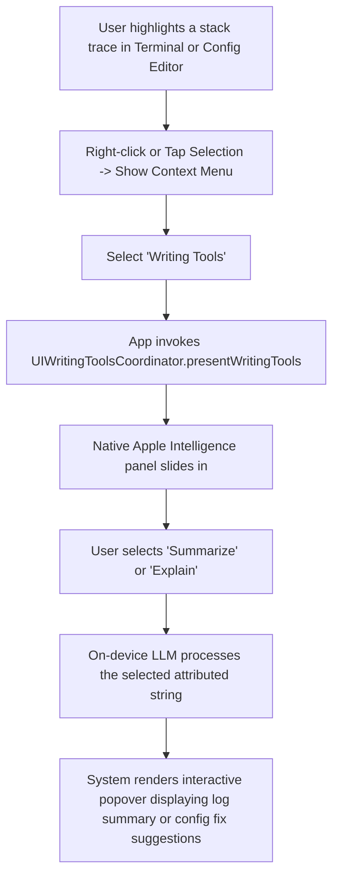

# 05. Writing Tools API for Logs & Configs

## Overview

Reading raw terminal log output, decrypting stack traces, or double-checking an SSL server block configuration is mentally taxing, especially on compact screens like an iPad or iPhone. With the **Writing Tools API**, `agent-ssh` hooks directly into the native Apple Intelligence text enhancement overlay. 

When a user selects lines of code or log streams inside our custom viewers, they gain access to system-wide tools. They can instantly **Summarize** a trace, **Explain** a cryptic config line, or **Format** a config file without leaving their active SSH or SFTP panel.

---

## Technical Architecture

For standard views using UIKit (`UITextView`) or SwiftUI (`TextEditor`), Apple Intelligence Writing Tools support is provided automatically by the OS. However, `agent-ssh` uses custom high-performance rendering views (such as the SPM-vendored **SwiftTerm** terminal engine and custom code editors). To bring Writing Tools to these custom rendering canvases, we implement the **`UIWritingToolsCoordinator`** (on iOS/iPadOS) and **`NSWritingsToolsCoordinator`** (on macOS).

### Custom Text Engine Integration Concept

Here is the design for integrating Apple's Writing Tools coordinator with our custom log and configuration viewer panels:

```swift
import UIKit

#if canImport(UIKit)
@available(iOS 18.0, *)
class CustomLogViewerCanvas: UIView {
    // 1. Define the coordinator that handles interactions with the system Writing Tools UI
    private var writingToolsCoordinator: UIWritingToolsCoordinator?
    
    // Internal backing store using attributed strings for precise formatting
    private var attributedTextStore: NSMutableAttributedString = NSMutableAttributedString(string: "")
    
    override init(frame: CGRect) {
        super.init(frame: frame)
        setupWritingTools()
    }
    
    required init?(coder: NSCoder) {
        super.init(coder: coder)
        setupWritingTools()
    }
    
    private func setupWritingTools() {
        // 2. Initialize the coordinator and point it to our delegate interface
        let coordinator = UIWritingToolsCoordinator(delegate: self)
        self.writingToolsCoordinator = coordinator
        
        // 3. Attach the coordinator to the view
        self.addInteraction(coordinator.interaction)
    }
    
    /// Triggered when the user highlights a selection and selects "Writing Tools" from the menu
    func userRequestedWritingTools(for range: NSRange) {
        guard let coordinator = writingToolsCoordinator else { return }
        
        // Present the native Apple Intelligence panel over our highlighted text selection
        coordinator.presentWritingTools()
    }
}

// MARK: - UIWritingToolsCoordinator.Delegate
@available(iOS 18.0, *)
extension CustomLogViewerCanvas: UIWritingToolsCoordinator.Delegate {
    
    /// Returns the text range currently selected in our custom engine
    func writingToolsCoordinator(_ coordinator: UIWritingToolsCoordinator,
                                 rangeForSelectedTextIn context: UIWritingToolsCoordinator.Context) async -> NSRange {
        // Retrieve the current active text selection range from our terminal/editor state
        return self.currentSelectionRange()
    }
    
    /// Delivers the raw selected text string to the Apple Intelligence system
    func writingToolsCoordinator(_ coordinator: UIWritingToolsCoordinator,
                                 textFor range: NSRange,
                                 in context: UIWritingToolsCoordinator.Context) async -> NSAttributedString? {
        // Return the attributed text representing our log lines or config settings
        return self.attributedTextStore.attributedSubstring(from: range)
    }
    
    /// Receives the Apple Intelligence formatted or rewritten text suggestion
    func writingToolsCoordinator(_ coordinator: UIWritingToolsCoordinator,
                                 replaceRange range: NSRange,
                                 in context: UIWritingToolsCoordinator.Context,
                                 with replacementText: NSAttributedString,
                                 reason: UIWritingToolsCoordinator.ReplacementReason) async {
        // Apply the replacement. For log viewers, this can display an inline LLM summary box.
        // For configuration editors (like nginx.conf), this replaces or rewrites the config lines safely.
        self.applyAttributedReplacement(range: range, replacement: replacementText)
    }
}
#endif
```

### Flow Diagram



---

## Native User Experience

1. **System-Native Popovers**: Highlighting text displays the standard macOS/iOS selection menu. Tapping **Writing Tools** opens the glowing Apple Intelligence overlay. The user doesn't feel like they are using a custom developer prompt; they are using the same native tools they use in Apple Notes or Pages.
2. **Explaining Configurations**: Highlighting a complex line in `sshd_config` (such as a parsing error) and selecting **Explain** opens a beautiful native card that translates the directive into plain English and highlights security implications.
3. **Log Condensation**: For server dumps with thousands of duplicate trace lines, selecting the block and choosing **Summarize** condenses the output into a single bulleted card showing exactly which exception was thrown and at what timestamp.

---

## Data Privacy & Guardrails

* **Explicit Selection Only**: Unlike a passive background collector, the Writing Tools coordinator only transmits the *explicitly highlighted block* of text to the OS intelligence sandbox. 
* **Zero Host Impact**: The Writing Tools API acts purely on the client-side text buffer. It cannot execute commands, change configuration files on disk, or trigger network scripts, ensuring complete read-only peace of mind.
* **Pre-Sanitized Text Exports**: In our delegate method, we can optionally programmatically strip out IP addresses or API keys from the `NSAttributedString` *before* returning it to the system coordinator, providing an extra layer of active user protection.

---

## Marketing & Positioning Strategy

### The Headline / Elevator Pitch
> *"Decrypt server logs instantly. The power of Apple Writing Tools, built directly into your terminal."*

### Feature Showcase Scenario (App Store Video Storyboard)
* **Visual**: A developer is holding an iPad Pro in split-screen mode, viewing a long, chaotic Postgres migration log in Midnight SSH.
* **Action**: They highlight a messy 20-line SQL exception block, tap the selection, and select **Writing Tools -> Summarize**.
* **Animation**: The screen glows with Apple Intelligence's signature color gradient. A beautifully summarized popover slides in: `Summary: The database migration failed because the 'users' table already has a column named 'email'.`
* **Voiceover**: *"Stop squinting at massive terminal log files. Highlight any trace, log, or config setting, and let native Apple Writing Tools break it down instantly."*

### Developer Buzzwords & Messaging
* **Native Selection Intelligence**: Direct text-engine hooks.
* **Inline Attributed Explanation**: Attributed formatting in explanation popovers.
* **No-Prompt Explanations**: System-level parsing without writing manual prompts.

### Competitive Edge (Why Competitors Can't Compete)
* **Web-Wrapper SSH Apps**: Apps built with Electron or generic web-views cannot hook into native macOS/iOS Cocoa coordinators like `UIWritingToolsCoordinator` with deep, rich selection ranges.
* **Our Edge**: By writing a native Swift application that integrates directly with Apple's Cocoa rendering pipeline, `agent-ssh` provides the smoothest, most seamless text AI integration possible on iPadOS and macOS.
