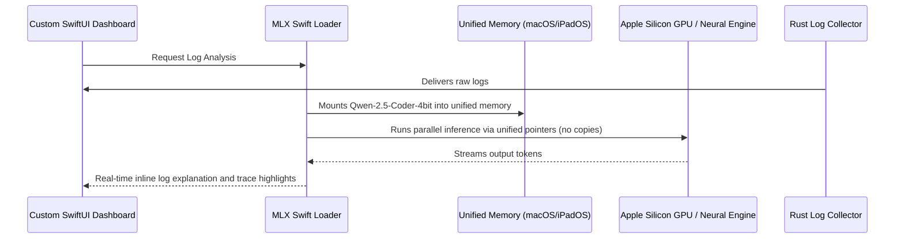

# 07. Local MLX-Powered Log & Diagnostic Parser

## Overview

While Apple's native Foundation Models framework is excellent for high-level summaries and general text analysis, server administration is a highly specialized domain. Custom server configurations, cryptic logs, and complex database status outputs require specialized training. 

With **Local MLX-Powered Diagnostics**, `agent-ssh` leverages Apple's open-source **MLX framework** (`mlx-swift`). By running specialized, small developer models (such as *Qwen-2.5-Coder-1.5B-Instruct* or *Llama-3.2-3B-Instruct* converted to MLX format) locally on Apple Silicon unified memory, we achieve deep, offline diagnostic reasoning that is optimized for terminal logs and developer configurations.

---

## Technical Architecture

MLX is Apple's custom machine learning array framework, specifically optimized for Apple Silicon GPUs and the Apple Neural Engine. It uses **Unified Memory**, meaning both the CPU and GPU can read and write to the same memory addresses, eliminating data copies and maximizing text generation speeds.

### MLX Swift Integration Concept

Here is the design for loading and running a local quantized model using the `mlx-swift` package:

```swift
import Foundation
import MLX
import MLXLMHelper // High-level helper for loading and generating with MLX models

/// A local LLM runner that executes custom open-weights models locally via MLX-swift.
class LocalMlxModelRunner {
    private var modelContainer: ModelContainer?
    private let modelDirectory: URL
    
    init(modelDirectory: URL) {
        self.modelDirectory = modelDirectory
    }
    
    /// Loads a quantized 4-bit model (e.g. Qwen-2.5-Coder-1.5B) into unified memory.
    func loadModel() async throws {
        // MLX leverages unified memory, making loading fast and lightweight
        let container = try await ModelContainer.load(
            hub: HubModel(
                id: "mlx-community/Qwen2.5-Coder-1.5B-Instruct-4bit",
                directory: modelDirectory
            )
        )
        self.modelContainer = container
    }
    
    /// Generates structured DevOps analysis on raw log dumps.
    func analyzeLogs(rawLogText: String) async throws -> String {
        guard let container = modelContainer else {
            throw NSError(domain: "LocalMlxModelRunner", code: 1, userInfo: [NSLocalizedDescriptionKey: "Model not loaded."])
        }
        
        let prompt = """
        <|im_start|>system
        You are a senior systems engineer. Analyze the provided server logs and identify the root cause.
        Highlight syntax errors or out of memory warnings. Be concise.
        <|im_end|>
        <|im_start|>user
        Analyze these server logs:
        \(rawLogText)
        <|im_end|>
        <|im_start|>assistant
        """
        
        // Run generation directly on Apple Silicon unified memory
        let result = try await container.generate(
            prompt: prompt,
            parameters: GenerateParameters(
                temperature: 0.1,
                maxTokens: 512
            )
        ) { progress in
            // Real-time token streaming callback for terminal UI rendering
            print("Generated token count: \(progress.tokenCount)")
        }
        
        return result.text
    }
}
```

### Flow Diagram



---

## Native User Experience

1. **Model Management Panel**: An interactive settings view inside the app allows advanced developers to:
   * View which local models are installed.
   * Check unified memory footprint (e.g., *"Qwen-2.5-Coder uses 980MB RAM"*).
   * Perform benchmark runs showing token speed (e.g., *"Generating at 48 tokens/sec"*).
2. **Streaming Explanations**: When inspecting logs in the terminal, the explanation prints character-by-character as it is generated, with subtle highlight colors overlaying raw terminal codes.
3. **Completely Offline Workspace**: Requires no internet connection once the model is downloaded, keeping log analysis fully offline and air-gapped.

---

## Data Privacy & Guardrails

* **Zero Cloud Connection**: The MLX framework is an open-source library running entirely locally on-device. No telemetry, logs, or prompt histories are transmitted.
* **App Sandbox Protection**: Downloaded models are stored securely within the app's standard `ApplicationSupport` folder, protected by sandboxing.
* **Resource Safety Capping**: Automatically limits token counts and disables execution if the host system is under heavy CPU or memory pressure to ensure the OS remains highly responsive.

---

## Marketing & Positioning Strategy

### The Headline / Elevator Pitch
> *"Bring specialized Coder LLMs directly to your terminal. High-performance offline log triaging powered by Apple Silicon."*

### Feature Showcase Scenario (App Store Video Storyboard)
* **Visual**: A developer’s macOS screen showing Midnight SSH, looking at a highly complex Kubernetes log file with thousands of lines.
* **Action**: They click **Local MLX Doctor**, select the *Qwen-2.5-Coder* model from the dropdown, and press **Analyze**.
* **Outcome**: A sidebar instantly streams a technical breakdown, highlighting a hidden race condition in the Go runtime. A status indicator shows: `Generated locally using MLX. Speed: 52 tokens/s. Memory: 1.1GB.`
* **Voiceover**: *"Don't settle for generic AI. Load highly-specialized Coder models directly into your terminal environment, utilizing Apple Silicon's unified memory for blazing-fast local diagnostics."*

### Developer Buzzwords & Messaging
* **MLX-Accelerated Diagnostics**: Leveraging Apple's custom framework.
* **Unified Memory Execution**: Direct zero-copy memory pipelines.
* **Specialized Developer Models**: Coder-focused models running locally.

### Competitive Edge (Why Competitors Can't Compete)
* **Termius & Others**: If they support AI, they do so through standardized, cloud-based ChatGPT endpoints. They cannot provide highly-specialized developer models running locally on your hardware.
* **Our Edge**: By integrating the high-performance `mlx-swift` engine, `agent-ssh` becomes the first SSH client capable of running complex, multi-billion parameter open-weights developer models completely offline on your Mac or iPad, setting a new standard for private DevOps triaging.
