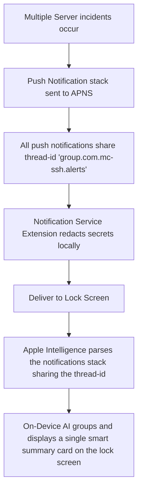

# 08. APNS Alert Summarization

## Overview

When multiple alerts occur in production (e.g., dynamic scaling events, container crashes, load warning spikes), notifications often flood the lock screen. The user is greeted by a chaotic list of 30 separate notification cards, causing critical information to be lost in the noise. With **APNS Alert Summarization**, `agent-ssh` structures notification payloads to be highly compatible with Apple Intelligence’s native lock screen summarizer. 

By grouping, setting semantic categories, and employing highly descriptive summary layouts, Apple Intelligence combines the entire stack of alerts into a single, cohesive lock screen notification displaying a clear summary of which servers need attention.

---

## Technical Architecture

To enable Apple Intelligence to successfully summarize a stack of alerts, notifications must be structured using standard thread IDs and dynamic target content. We implement this using the native `UserNotifications` framework and **APNS payload design**.

### Structured APNS Alert Payload Design

When the monitoring system sends a push notification (or when the app schedules a local diagnostic alert in the background), it uses this payload structure:

```json
{
  "aps": {
    "alert": {
      "title": "Server Alert: web-prod-01",
      "subtitle": "High CPU warning",
      "body": "Nginx CPU utilization is at 94%. Redacted worker processes: 8. Target thread ID: group.com.mc-ssh.alerts."
    },
    "badge": 1,
    "sound": "critical_alert.aiff",
    "thread-id": "group.com.mc-ssh.alerts",
    "category": "SERVER_DOCTOR_ALERT",
    "mutable-content": 1
  },
  "custom_metadata": {
    "host_id": "uuid-web-prod-01",
    "incident_severity": "high",
    "subsystem": "web_proxy"
  }
}
```

### Local Notification Service Extension Implementation

To ensure unredacted or sensitive server info is stripped locally *before* Apple Intelligence processes the notification on the lock screen, we implement a **Notification Service Extension** (`UNNotificationServiceExtension`).

```swift
import UserNotifications
import AgentSshMacOS

class NotificationService: UNNotificationServiceExtension {
    var contentHandler: ((UNNotificationContent) -> Void)?
    var bestAttemptContent: UNMutableNotificationContent?

    override func didReceive(_ request: UNNotificationRequest, withContentHandler contentHandler: @escaping (UNNotificationContent) -> Void) {
        self.contentHandler = contentHandler
        bestAttemptContent = (request.content.mutableCopy() as? UNMutableNotificationContent)
        
        guard let bestAttemptContent = bestAttemptContent else { return }
        
        // 1. Retrieve the custom metadata payload
        let userInfo = bestAttemptContent.userInfo
        guard let metadata = userInfo["custom_metadata"] as? [String: Any],
              let severity = metadata["incident_severity"] as? String else {
            contentHandler(bestAttemptContent)
            return
        }
        
        // 2. Perform local redaction check
        let rawBody = bestAttemptContent.body
        let redactedBody = LocalRedactor.shared.redactSecrets(in: rawBody)
        
        // 3. Format the body to assist Apple Intelligence's local summarization engine
        // Placing structural headers (like 'Host:', 'Severity:') guides the OS summarizer.
        bestAttemptContent.body = """
        [Midnight SSH Alert]
        Host: \(metadata["host_id"] ?? "Unknown")
        Severity: \(severity.uppercased())
        Details: \(redactedBody)
        """
        
        // 4. Expose high-priority alerts as Critical if authorized
        if severity == "critical" {
            bestAttemptContent.sound = UNNotificationSound.defaultCritical
        }
        
        contentHandler(bestAttemptContent)
    }
}
```

### Flow Diagram



---

## Native User Experience

1. **Glanceable Lock Screen Summaries**: Instead of showing a long, messy stack of individual alerts, the lock screen displays a single card with Apple Intelligence’s glowing outline. The card reads:
   * 🔔 *Midnight SSH (3 Notifications)*:
   * *"Your web server `web-prod-01` is experiencing 94% CPU load, while database replica `db-replica-02` reports an active replication lag. Tap to inspect details."*
2. **Visual Hierarchy and Icons**: Small visual icons represent severity levels (e.g., red warning symbols), keeping the lock screen clean while conveying critical states.

---

## Data Privacy & Guardrails

* **Local Pre-Redaction**: The Notification Service Extension runs *locally on the device* immediately when the push packet arrives. This ensures that even if a push payload mistakenly contains a database URL or password, it is stripped *before* the OS reads it to compile the lock screen summary.
* **Granular Summary Opt-Out**: Users can customize this in the settings, choosing between **Full Smart Summary** (allows Apple Intelligence to summarize alert content) or **Categorized Counts Only** (strictly shows counts, e.g., *"3 alerts pending on 2 hosts"*).

---

## Marketing & Positioning Strategy

### The Headline / Elevator Pitch
> *"Zero Notification fatigue. Apple Intelligence summarizes all your server alerts into a single, cohesive lock screen brief."*

### Feature Showcase Scenario (App Store Video Storyboard)
* **Visual**: An iPhone resting on a desk. Multiple alert sounds play in rapid succession as a staging deployment encounters errors.
* **Action**: Instead of filling the screen with 25 separate warning logs, the OS automatically nests them.
* **Animation**: A single notification container appears. The outline glows as Apple Intelligence compiles the summary: `Midnight SSH: Standard deployment failed on staging-web; 3 pods are crashlooping due to a config error.`
* **Voiceover**: *"Never drown in alert fatigue. Midnight SSH structures notification logs so Apple Intelligence can summarize complex system failures into a single glance on your lock screen."*

### Developer Buzzwords & Messaging
* **Smart Stack Notifications**: Unified lock screen grouping.
* **Notification Service Pre-Redaction**: Localized security processing.
* **High-Signal Alerting**: Dynamic summary synthesis.

### Competitive Edge (Why Competitors Can't Compete)
* **Termius & Traditional SSH Clients**: Send basic, flat push alerts that quickly fill up the user's notification list, leading to alarm fatigue.
* **Our Edge**: By structuring alert threads and implementing a native `UNNotificationServiceExtension` that formats messages specifically for Apple Intelligence's local summarizing models, `agent-ssh` delivers the most elegant, noise-free alerting system on the App Store.
