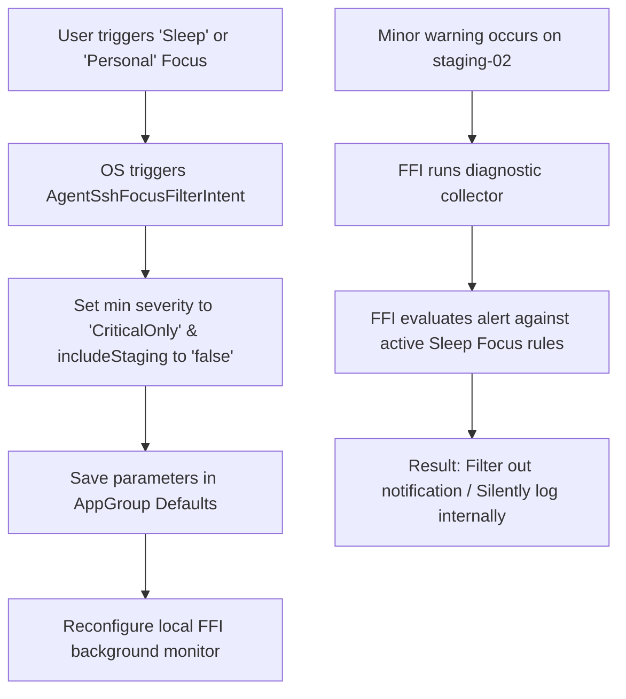

# 09. Focus Filters for Contextual Triage

## Overview

Systems engineers and administrators need to maintain a healthy work-life balance, but they also cannot afford to miss a critical production outage. With **Focus Filters**, `agent-ssh` integrates directly with iOS and macOS native **Focus Modes** (e.g., Work, Personal, Sleep). 

When a user switches focus modes, the app adjusts its notification priority and main dashboard interface. During a "Personal" or "Sleep" Focus, the on-device diagnostic engine automatically filters out minor warnings or staging alerts, only waking the user for high-severity issues on production systems. During a "Work" Focus, the dashboard prioritizes all staging, sandbox, and active development logs to maximize developer velocity.

---

## Technical Architecture

We implement this using Apple's **`FocusFilterIntent`** protocol (part of the `AppIntents` framework). This allows the system's native Settings app to display custom filter parameters for `agent-ssh`.

### AppIntent FocusFilter Implementation

```swift
import AppIntents
import Foundation

/// Exposes agent-ssh diagnostic filter parameters to Apple Focus settings.
@available(iOS 18.0, macOS 15.0, *)
struct AgentSshFocusFilterIntent: FocusFilterIntent {
    static var title: LocalizedStringResource = "Filter Server Notifications & Triages"
    static var description: LocalizedStringResource = "Adjust server monitoring parameters based on the active Focus mode."
    
    // Conforms to assistant schemas for automated orchestration
    static var assistantSchemas: [AssistantSchema] {
        [.diagnostics]
    }
    
    // Expose parameters that the user can configure in the OS Settings App per Focus Mode
    @Parameter(title: "Severity Threshold", default: .high)
    var severityThreshold: AlertSeverityThreshold
    
    @Parameter(title: "Include Staging Servers", default: false)
    var includeStaging: Bool
    
    enum AlertSeverityThreshold: String, AppEnum {
        case info
        case warning
        case high
        case criticalOnly
        
        static var typeDisplayRepresentation: TypeDisplayRepresentation = "Alert Severity Threshold"
        static var caseDisplayRepresentations: [AlertSeverityThreshold: LocalizedStringResource] {
            [
                .info: "Show all alerts (Informational+)",
                .warning: "Show warnings and above",
                .high: "Show high severity and above",
                .criticalOnly: "Show critical outages only"
            ]
        }
    }
    
    // Called by the OS whenever the user's Focus Mode changes
    func perform() async throws -> some IntentResult {
        // Save these filter parameters locally inside our secure shared UserDefaults container
        guard let sharedDefaults = UserDefaults(suiteName: "group.com.mc-ssh.agent-ssh") else {
            return .result()
        }
        
        sharedDefaults.set(severityThreshold.rawValue, forKey: "active_focus_severity_threshold")
        sharedDefaults.set(includeStaging, forKey: "active_focus_include_staging")
        
        // Notify the local FFI monitoring loop to adjust notification routing parameters
        try await BridgeManager.shared.reloadFocusParameters(
            minSeverity: severityThreshold.rawValue,
            includeStaging: includeStaging
        )
        
        return .result()
    }
}
```

### Flow Diagram



---

## Native User Experience

1. **Focus Integration in Settings**: When configuring a native Focus Mode (such as "Personal") in the system Settings app, the user scrolls to **Focus Filters** -> **Add Filter** -> **Midnight SSH**. They are greeted by a beautiful native sheet allowing them to configure the severity threshold and server scope.
2. **Dynamic App Dashboard**: Opening `agent-ssh` while in a specific focus mode adjusts the visual presentation. The host sidebar displays a subtle badge: *“Focus Filter Active: Showing Production Critical”*, instantly decluttering their workspace.

---

## Data Privacy & Guardrails

* **100% Local Logic**: The Focus Filter state is managed entirely within the local OS sandbox. The app never uploads the user's active focus schedule or daily routines to external monitoring clusters.
* **No Lost Alerts**: When alerts are filtered out, they are not deleted. They are logged privately into the local SQLite database container, allowing the user to view the complete history once they switch back to "Work" Focus.

---

## Marketing & Positioning Strategy

### The Headline / Elevator Pitch
> *"Reclaim your personal time. Intelligent focus filters that silence staging alerts while keeping production safe."*

### Feature Showcase Scenario (App Store Video Storyboard)
* **Visual**: A developer finishing their workday, walking out of the office. They tap the Control Center and switch from **Work** Focus to **Personal** Focus.
* **Action**: In the system Settings under Focus Filters, we see **Midnight SSH** set to *“Critical Only, Staging Excluded”*.
* **Outcome**: A minor memory warning occurs on the staging proxy server. The developer's phone remains silent. Later, a severe database lock occurs on the production primary, triggering a loud, critical vibration immediately.
* **Voiceover**: *"Outages don't respect office hours, but your peace of mind should. Set context-aware focus filters that screen out non-essential server alerts while prioritizing critical events when you're off-duty."*

### Developer Buzzwords & Messaging
* **Focus Filter Integrations**: Contextual app states.
* **Dynamic Severity Gauges**: Adapt notification thresholds on the fly.
* **Work-Life DevOps Balance**: Noise-free personal time.

### Competitive Edge (Why Competitors Can't Compete)
* **Termius & Slack Notifications**: Rely on global notification toggles. If you want to mute alerts, you have to remember to log in and turn off notifications globally, or risk being woken up by minor staging issues.
* **Our Edge**: By deeply integrating with Apple’s native `FocusFilterIntent` protocol, `agent-ssh` aligns with the user's active focus context. You don't have to manage notification settings manually—your phone handles it based on your location and daily schedule.
