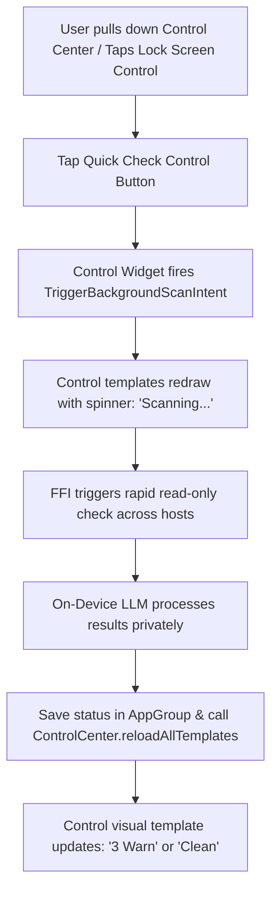

# 10. Control Center & Lock Screen Smart Quick Actions

## Overview

Opening an app to perform a quick status check during an on-call rotation can be tedious. In iOS 18 and macOS Sequoia, Apple introduced the **Controls API**, allowing third-party apps to place functional buttons directly in the Control Center, on the Lock Screen, or bound to the Action Button. 

By implementing **Smart Control Center Actions**, `agent-ssh` lets users trigger an instant background diagnostic collector sweep with a single tap. The control's title and icon update dynamically using on-device LLM synthesis to indicate if any hosts need immediate attention, providing a fast system-wide gateway to the **Server Doctor**.

---

## Technical Architecture

The Controls API relies on the native `WidgetKit` framework's new `ControlWidget` protocol. Unlike standard widgets that render complex SwiftUI hierarchies, a control is a compact, system-rendered button or toggle that executes a background `AppIntent` and updates its state dynamically.

### ControlWidget & Background Intent Implementation

```swift
import WidgetKit
import SwiftUI
import AppIntents

/// The system Control Widget that appears in the Control Center or Lock Screen
@available(iOS 18.0, macOS 15.0, *)
struct ServerQuickCheckControl: ControlWidget {
    static var title: LocalizedStringResource = "Server Quick Check"
    
    var body: some ControlWidgetConfiguration {
        // Exposes a button control that executes our background trigger intent
        ControlWidgetButton(action: TriggerBackgroundScanIntent()) {
            // Evaluates current state to determine system visual indicators
            let state = fetchCurrentScannerState()
            Label(state.title, systemImage: state.iconName)
        }
    }
    
    private func fetchCurrentScannerState() -> (title: String, iconName: String) {
        guard let sharedDefaults = UserDefaults(suiteName: "group.com.mc-ssh.agent-ssh"),
              let status = sharedDefaults.string(forKey: "control_status") else {
            return ("Check Servers", "server.rack.status.badge.warning")
        }
        
        switch status.lowercased() {
        case "unhealthy":
            let count = sharedDefaults.integer(forKey: "control_warn_count")
            return ("\(count) Warn", "exclamationmark.triangle.fill")
        case "checking":
            return ("Scanning...", "arrow.clockwise")
        default:
            return ("Clean", "checkmark.circle.fill")
        }
    }
}

/// The AppIntent fired immediately when the Control button is tapped from anywhere in the OS
@available(iOS 18.0, macOS 15.0, *)
struct TriggerBackgroundScanIntent: AppIntent {
    static var title: LocalizedStringResource = "Trigger Background Server Scan"
    
    func perform() async throws -> some IntentResult & ReturnsValue<String> {
        guard let sharedDefaults = UserDefaults(suiteName: "group.com.mc-ssh.agent-ssh") else {
            return .result(value: "Failed to locate AppGroup.")
        }
        
        // 1. Set status to scanning to update the control icon in real-time
        sharedDefaults.set("checking", forKey: "control_status")
        ControlCenter.shared.reloadAllTemplates() // Force Control Center redraw
        
        // 2. Trigger FFI Broad Host Collector
        let rawReport = try await BridgeManager.shared.diagnoseAllFast()
        
        // 3. Synthesize result using the on-device LLM
        let localSynthesizer = try await LocalDiagnosticsSynthesizer()
        let report = try await localSynthesizer.synthesizeReport(
            hostContext: "All monitored systems fast scan",
            redactedEvidenceJson: rawReport.evidenceJson
        )
        
        // 4. Update the stored states based on on-device LLM findings
        if report.overallSeverity == .critical || report.overallSeverity == .warning {
            sharedDefaults.set("unhealthy", forKey: "control_status")
            sharedDefaults.set(report.findings.count, forKey: "control_warn_count")
        } else {
            sharedDefaults.set("healthy", forKey: "control_status")
            sharedDefaults.set(0, forKey: "control_warn_count")
        }
        
        // 5. Reload templates to display the updated health check results
        ControlCenter.shared.reloadAllTemplates()
        
        return .result(
            value: report.summaryBriefing,
            dialog: "Scan complete. Status: \(report.findings.count) warnings found."
        )
    }
}
```

### Flow Diagram



---

## Native User Experience

1. **System-wide Accessibility**: The Control sits in the Control Center on macOS/iOS or on the iPhone Lock Screen (replacing the camera or flashlight shortcuts). Tapping it triggers the background scan seamlessly without waking the phone or sliding open the app.
2. **Instant Desktop Widgetry**: On macOS Sequoia, this Control can be dragged directly onto the desktop as a small, minimal status pill that stays locked to the bottom corner.
3. **Double-Click Action**: Developers can assign this `TriggerBackgroundScanIntent` to the **Action Button** on supported iPhone/Apple Watch hardware. A double press triggers a fast scan, vibrating with high-priority feedback if warnings are detected.

---

## Data Privacy & Guardrails

* **Rate-Limited Background Execution**: The system controls are highly sandboxed. Background scanner triggers are throttled by the OS to prevent background battery depletion or accidental rate-limiting on target SSH servers.
* **Metadata Containment**: No complex logs, configuration parameters, or terminal codes are exposed in the `UserDefaults` backing file. Only broad status indicators (*"checking"*, *"unhealthy"*, *"healthy"*) and finding counts are stored at rest.

---

## Marketing & Positioning Strategy

### The Headline / Elevator Pitch
> *"Your server health, one tap away. Lock screen quick actions and desktop controls powered by iOS 18."*

### Feature Showcase Scenario (App Store Video Storyboard)
* **Visual**: A close-up of a lock screen on an iPhone 16 Pro. The bottom corner features a custom Midnight SSH server icon instead of the camera icon.
* **Action**: The developer double-taps the lock screen icon.
* **Outcome**: A small loading indicator spins, and in a second, the icon changes to a checkmark: `Clean`.
* **Action**: They swipe down, showing the macOS/iOS Control Center with a larger status panel displaying *"0 Alerts"*.
* **Voiceover**: *"Never wonder if a server is failing. Replace your default lock screen controls with an instant, private DevOps health scanner that keeps you informed with a single tap."*

### Developer Buzzwords & Messaging
* **Lock Screen Quick Controls**: Seamless OS entry points.
* **Controls API Integration**: Standard-setting iOS 18 / macOS Sequoia functionality.
* **Action Button DevOps**: Physical hardware execution.

### Competitive Edge (Why Competitors Can't Compete)
* **Termius & Server Monitoring Suites**: Keep diagnostics buried inside multi-screen app tabs. There is no simple way to check system states without logging into the app and starting SSH tunnels.
* **Our Edge**: By being the first app to embrace iOS 18’s Controls API for background server diagnostics, `agent-ssh` becomes a native utility extension of the system shell. We turn the iPhone Lock Screen and Mac Desktop into a proactive monitoring dashboard.
